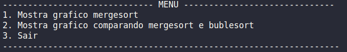
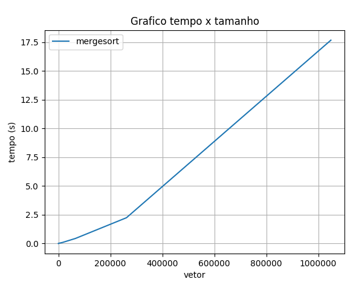
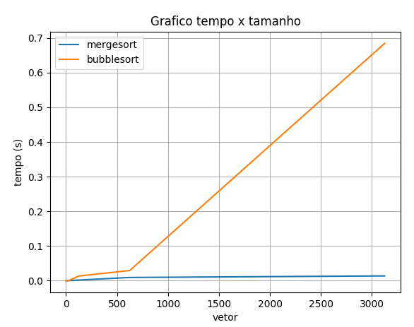

# D&C Dupla2 turma B 

**Número da Lista**: 4<br>
**Conteúdo da Disciplina**: D&C<br>

## Alunos
|Matrícula | Aluno |
| -- | -- |
| 15/0132344  |  João Pedro Soares Cirqueira |
| 15/0136862  |  Lucas Alexandre Fernandes Martins |

## Sobre 
O projeto consiste em mostrar o tempo de ordenação de um vetor gerado aleatoriamente utilizando o algoritmo mergeSort para esta ordenação, sendo um gráfico com relação entre o tamanho do vetor e o tempo de execução. Também é feito uma comparação entre o algoritmo mergeSorte e bubbleSort.

## Screenshots






## Instalação 
**Linguagem**: Python<br>
- Biblioteca matplotlib instalada
> ``` $ pip install matplotlib```

### Linux

#### Pelo terminal
- Para clonar o repositório:
> $ git clone https://github.com/projeto-de-algoritmos/D-C_Dupla2B

## Uso 
Execute o programa com o comando 
``` $ python3 main.py ```
siga as intruções do termial

## Outros 
O video com a explicação sobre o projeto está dentro da pasta video.


